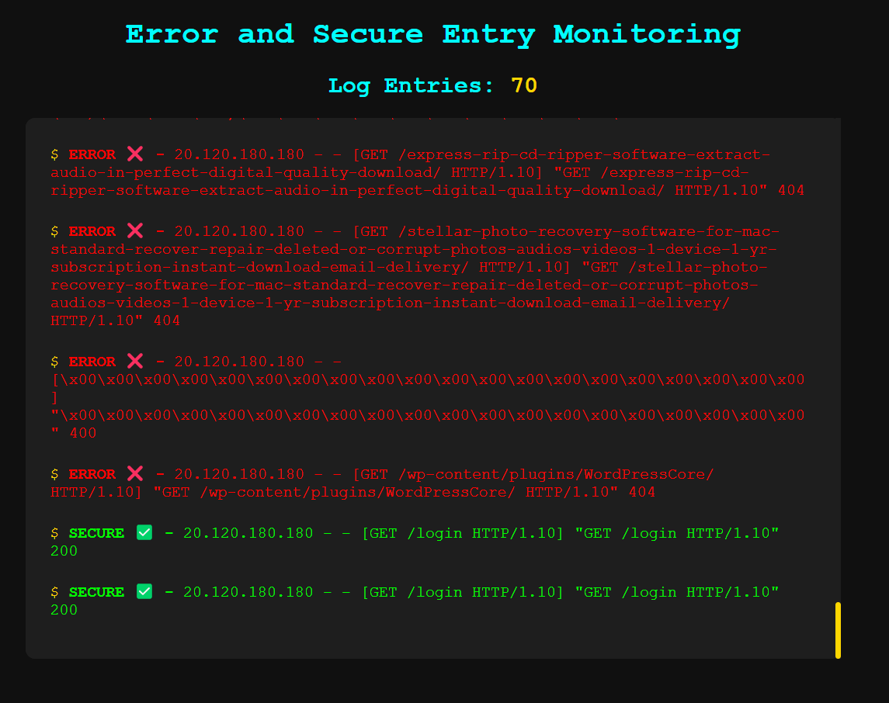
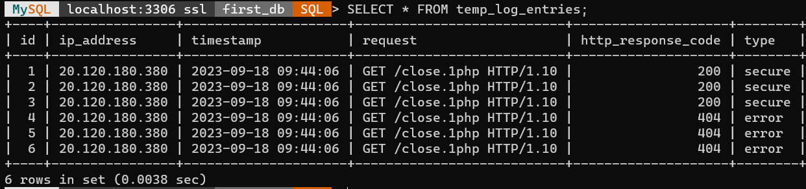

# [Log Monitoring Web App](https://youtu.be/XrOf0d-y1mE)

## Table of Contents

- [Tech Stack Used](#tech-stack-used)
- [Project Description](#project-description)
- [Issues Faced](#issues-faced)
- [Approach Used](#approach-used)
- [Installation](#installation)
- [Contributing](#contributing)
- [Contact Developer](#contact-developer)

## Tech Stack Used

- Python
- Flask (Web Framework)
- Socket.IO (Real-time communication)
- HTML/CSS/JavaScript

## Project Description

This project is a web application that monitors log entries from an error log file. It displays log entries in real-time and categorizes them as secure or error based on the HTTP response code. The application uses Flask for the backend to serve the web pages, Socket.IO for real-time communication, and HTML/CSS/JavaScript for the frontend. The log entries are stored in a MySQL database.

## Issues Faced

1. Real-time Data Synchronization:
   - **Issue:** Achieving real-time updates from the log file to the web interface posed a challenge.
   - **Solution:** Implementation of Socket.IO and designing a suitable data synchronization strategy to achieve real-time updates
2. Log Parsing and Data Extraction:
   - **Issue:** Extracting relevant information from the log entries, particularly dealing with varying log formats.
   - **Solution:** Developing a robust parsing algorithm to handle different log patterns and extract essential data.

## Approach Used

A description of the approach used for your log monitoring web app :

1. **Understanding Requirements:**

   - Analyzed the project requirements and identified the need for a real-time log monitoring web application that extracts and displays relevant information from a log file.

2. **Technology Stack Selection:**

   - Chose appropriate technologies based on project requirements, including Python for server-side logic (Flask), real-time updates (Socket.IO), and front-end development (HTML, CSS, JavaScript).

3. **Log Parsing and Data Extraction:**

   - Developed a log parsing algorithm to extract crucial information (IP address, timestamp, request, HTTP response code) from log entries, accommodating variations in log formats.

4. **Integration with MySQL Database:**

   - Configured and integrated MySQL database to store error log entries (HTTP response code other than 200) for efficient data storage and retrieval.

   

5. **Real-time Data Synchronization:**

   - Implemented Socket.IO to establish a bidirectional communication channel between the server and clients, enabling real-time updates of log entries without requiring manual page refreshes.

6. **Front-end Development:**

   - Designed a user-friendly web interface using HTML and CSS to display log entries in a clear and organized manner, differentiating between secure and error entries.

7. **Deployment and Testing:**

   - Deployed the web application on an appropriate server, ensuring its smooth functioning and responsiveness. Conducted thorough testing to identify and address any bugs or issues.

8. **Documentation and README:**

   - Created comprehensive documentation, including a README file, to provide clear instructions on how to use the application, install dependencies, contribute, and contact the developer.

9. **Version Control:**
   - Utilized a version control system (e.g., Git) to manage the project's codebase, track changes, and collaborate with other developers effectively.

This approach enabled the successful development and deployment of a real-time log monitoring web application, meeting the specified requirements and delivering a valuable tool for monitoring and analyzing log data.

## Installation

1. Clone the repository.
2. Install the required dependencies using `pip install -r requirements.txt`.
3. Set up the MySQL database and configure the connection (see [MySQL Setup](#mysql-setup)).
4. Run the application using `python app.py`.

### MySQL Setup

- Install MySQL and create a database.
- Update the MySQL configuration in the `app.py` file with your MySQL credentials.

## Contributing

If you'd like to contribute to this project, feel free to fork the repository and submit a pull request.

## Contact Developer

For any inquiries or feedback regarding the project, please contact:

- Developer: [Anant Choubey](mailto:anantchoubey039@gmail.com)
